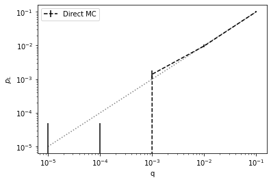

qsample
================

<!-- WARNING: THIS FILE WAS AUTOGENERATED! DO NOT EDIT! -->

## Install

------------------------------------------------------------------------

    pip install qsample

## \## Prerequisites

- This package requires Python 3.9 or higher.  
- pdflatex (for circuit rendering)

## When to use

------------------------------------------------------------------------

- Define QEC protocols that consist of one or more quantum circuits with
  in-sequence measurements and feed-forward of measurement information  
- Apply circuit-level incoherent Pauli noise at low physical error rates
  (i.e. high fidelity physical operations)
- Simulate and sample protocol execution over ranges of varying physical
  error rates, using customizable callbacks

## \## Getting started

Define a quantum protocol to sample from. In `qsample` a protocol is
represented as a graph with quantum
[`Circuit`](https://dpwinter.github.io/qsample/circuit.html#circuit)s as
nodes and transition `checks` as edges.

To sample logical error rates of an error-corrected quantum state
teleportation protocol, we define the teleportation circuit which sends
the state of the first to the third qubit.

``` python
from qsample.circuit import Circuit

teleport = Circuit([{"init": {0, 1, 2}},
                    {"H": {1}},
                    {"CNOT": {(1, 2)}},
                    {"CNOT": {(0, 1)}},
                    {"H": {0}},
                    {"measure": {0, 1}}])

teleport.draw()
```


Additionally, we need a circuit to (perfectly) measure the third qubit
after running `teleport`. If the outcome of this measurement is 0
(corresponding to the initially prepared $|0\rangle$ state of qubit 1)
the teleportation succeded. If the outcome is 1 however, we want to
count a logical failure of this protocol.

``` python
meas = Circuit([{"measure": {2}}], noisy=False)

meas.draw()
```


Between `teleport` and `meas` apply a correction to qubit 3 conditioned
on the measurement outcome (syndrome) of the teleportation circuit. We
define the lookup function `lut`

``` python
def lut(syn):
    op = {0: 'I', 1: 'X', 2: 'Z', 3: 'Y'}[syn]
    return Circuit([{op: {2}}], noisy=False)
```

Finally, define the circuit sequence and transition logic in a
[`Protocol`](https://dpwinter.github.io/qsample/protocol.html#protocol),
commenced by a *START* and terminated by a *FAIL* node.

``` python
from qsample.protocol import Protocol

tele_proto = Protocol(check_functions={'lut': lut})
tele_proto.add_nodes_from(['tele', 'meas'], circuits=[teleport, meas])
tele_proto.add_edge('START', 'tele', check='True')
tele_proto.add_edge('tele', 'COR', check='lut(tele[-1])')
tele_proto.add_edge('COR', 'meas', check='True')
tele_proto.add_edge('meas', 'FAIL', check='meas[-1] == 1')

tele_proto.draw(figsize=(8,5))
```


Notice that we do not define any initial circuit for the correction
*COR* but pass our lookup function to the `check_functions` dictionary,
which makes it accessible inside the `check` transition statements
(edges) between circuits. This way we can dynamically insert circuits
into our protocol at execution time.

After the protocol has been defined we can repeatedly execute
(i.e. sample) it in the presence of incoherent noise. Let’s say we are
interested in the logical error rates for physical error rates on all 1-
and 2-qubit gates of $p_{phy}=10^{-4}, 10^{-3}$, and $10^{-2}$. The
corresponding noise model is called
[`E1`](https://dpwinter.github.io/qsample/noise.html#e1) in qsample. The
groups of all 1- and 2-qubit gates are indexed by the key *q* in
[`E1`](https://dpwinter.github.io/qsample/noise.html#e1).

``` python
from qsample.noise import E1

err_params = {'q': [1e-5, 1e-4, 1e-3, 1e-2, 1e-1]}
```

We are ready to sample. As our protocol only contains Clifford gates
let’s choose the
[`StabilizerSimulator`](https://dpwinter.github.io/qsample/sim.stabilizer.html#stabilizersimulator),
as well as the
[`PlotStats`](https://dpwinter.github.io/qsample/callbacks.html#plotstats)
callback for plotting the resulting logical error rate as function of
$p_{phy}$.

``` python
from qsample.sampler.direct import DirectSampler
from qsample.sim.stabilizer import StabilizerSimulator as CHP
from qsample.callbacks import PlotStats

sam = DirectSampler(protocol=tele_proto, simulator=CHP, err_model=E1, err_params=err_params)
sam.run(n_shots=10000, callbacks=[PlotStats()])
```

    p=('1.00e-05',):   0%|          | 0/10000 [00:00<?, ?it/s]

    p=('1.00e-04',):   0%|          | 0/10000 [00:00<?, ?it/s]

    p=('1.00e-03',):   0%|          | 0/10000 [00:00<?, ?it/s]

    p=('1.00e-02',):   0%|          | 0/10000 [00:00<?, ?it/s]

    p=('1.00e-01',):   0%|          | 0/10000 [00:00<?, ?it/s]



At large physical error rates
[`DirectSampler`](https://dpwinter.github.io/qsample/sampler.direct.html#directsampler)
gives good results. However, the lower the error rate, the larger the
errorbars on the logical error rate become, as most of the time the
protocol is executed error free and, consequently, logical errors are
measured infrequently. At low physical error rates it is much more
efficient use an importance sampling strategy, which if possible avoids
fault-free protocol execution and instead puts more emphasis on
execution with at least one fault (so called subset) occurring. This
approach is implemented in the
[`SubsetSampler`](https://dpwinter.github.io/qsample/sampler.subset.html#subsetsampler)
class. We only need to specify one additional parameter `p_max` which
specifies the $p_{phy}$ at which sampling takes place. This parameter
must be chosen experimentally by repeated sampling and observing which
subsets have the largest impact on the failure rate. However, we must
always choose a value such that the subset occurence probability has an
exponentially falling shape. Only in this case is the scaling of the
sampling results valid. Below we see that for the teleportation circuit
a `p_max` of 0.01 and 0.1 is still okay, while 0.3 would be a
problematic value. For more information on this approach to sampling
refer to the linked publication.

``` python
import qsample.math as math

for p_phy in [0.01, 0.1, 0.3]:
    Aws = math.subset_probs(teleport, E1(), p_phy)
    plt.figure()
    plt.title("Subset occurence prob. $A_w$ at $p_{phy}$=%.2f" % p_phy)
    plt.bar(list(map(str,Aws.keys())), Aws.values())
    plt.ylabel("$A_w$")
    plt.xlabel("Subsets")
```


Let’s choose a $p_{max}=0.1$ for the same error model as before and
start sampling. (Note the significant difference in the number of
samples)

``` python
from qsample.sampler.subset import SubsetSampler

ss_sam = SubsetSampler(protocol=tele_proto, simulator=CHP,  p_max={'q': 0.1}, err_model=E1, err_params=err_params)
ss_sam.run(500, callbacks=[PlotStats()])
```

    p=('1.00e-01',):   0%|          | 0/500 [00:00<?, ?it/s]


The sampling results are internally stored by the
[`SubsetSampler`](https://dpwinter.github.io/qsample/sampler.subset.html#subsetsampler)
in a [`Tree`](https://dpwinter.github.io/qsample/sampler.tree.html#tree)
data structure

``` python
ss_sam.tree.draw(verbose=True)
```


We see that only the teleportation protocol has fault weight subsets,
while the *meas* and *COR* circuits are noise-free (ie.e no subsets).
The leaf nodes *FAIL* and *None* represent logical failure and
successful teleportation events, respectively. $\delta$ represents the
missing subsets which have not been sampled and which result in the
upper bound on the failure rate (*SS up*).

Finally, let’s compare the results of
[`DirectSampler`](https://dpwinter.github.io/qsample/sampler.direct.html#directsampler)
and
[`SubsetSampler`](https://dpwinter.github.io/qsample/sampler.subset.html#subsetsampler).

``` python
p_L_low, std_low, p_L_up, std_up = ss_sam.stats()
p_L, std = sam.stats()

import matplotlib.pyplot as plt

sample_range = err_params['q']
plt.errorbar(sample_range, p_L, fmt='--', c="black", yerr=std, label="Direct MC")
plt.loglog(sample_range, p_L_low, label='SS low')
plt.fill_between(sample_range, p_L_low - std_low, p_L_low + std_low, alpha=0.2)
plt.loglog(sample_range, p_L_up, label='SS low')
plt.fill_between(sample_range, p_L_up - std_up, p_L_up + std_up, alpha=0.2)
plt.plot(sample_range, sample_range,'k:', alpha=0.5)
plt.xlabel('$p_{phy}$(q)')
plt.ylabel('$p_L$')
plt.legend();
```


More things to explore: \* `qsample.examples` shows more examples of
protocol and protocol samplings. \* `qsample.noise` defines more complex
error models, as well as a superclass
[`ErrorModel`](https://dpwinter.github.io/qsample/noise.html#errormodel)
which can be used to define custom error models. \* `qsample.callbacks`
defines more callbacks, as well as the superclass
[`Callback`](https://dpwinter.github.io/qsample/callbacks.html#callback)
which allows for the implementation of custom callbacks.

## Contribute

------------------------------------------------------------------------

- Feel free to submit your feature request via github issues

## \## Team

`qsample` was developed by Don Winter based on and in collaboration with
Sascha Heußen under supervision of Prof. Dr. Markus Müller.
