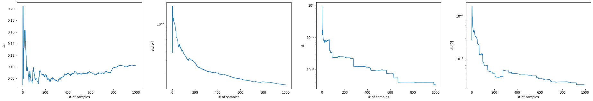

qsample
================

<!-- WARNING: THIS FILE WAS AUTOGENERATED! DO NOT EDIT! -->

## Install

We are currently in the process to reclaim the name from PyPI, s.t. this
package can be installed directly via `pip`.

However, for now you need to do the following steps:  
1. Clone the repository to your computer.  
2. Go to `qsample` directory.  
3. Execute `pip install -e .`

## Prerequisites

- This package requires Python 3.8 or higher.  
- All requirements are installed automatically via pip.  
- External requirements are latex (for circuit rendering)  
- Preferred usage in Jupyter notebooks

## When to use

qsample offers efficient and fast estimation of logical failure rates of
quantum error correction protocols when the fidelity of physical
operations in the quantum circuits is high, such as in expertimental
implementations today.

This package is for you if you want to \* model circuit-level incoherent
Pauli noise (we don’t do coherent noise here, neither are our auxiliary
qubits modelled as ideal) \* with high fidelity physical operations aka
low physical error rates \* for a QEC protocol that consists of
execution of one or more quantum circuits with in-sequence measurements
and feed-forward of measurement information \* over a specific range of
varying physical error rates

It currently offers to \* build quantum circuits from the standard
quantum gates: H, X, Z, CNOT \* run stabilizer simulations with a
standard CHP backend \* model multiparameter noise with distinct error
rates for single- and two-qubit gates: p1, p2 \* estimate logical
failure rates until uncertainty is lower than a given target confidence
interval \* choose direct Monte Carlo or Subset Sampling as sampling
method

Background information:

The predominant method to model incoherent Pauli noise in quantum
circuits is direct Monte Carlo (MC) sampling. MC is very inefficient for
low physical error rates since most of the time no actual fault event is
realized in simulation. Subset sampling circumvents this issue. With
this method, presented in , fault events are categorized into distinct
subsets which contribute to a polynomial sum expansion of the logical
failure rate. In subset sampling, only the subsets that contribute most
to the logical failure rate are actually estimated via sampling –
rendering it an importance sampling technique. Both the sampling
variance and the uncertainty from ignored, i.e. non-sampled, subsets
stay well-defined and can be held small throughout the sampling
procedure.

## Getting started

### Circuits

To get started, we first need to define one or more circuits, which is
easily done in qsam. Below we create a circuit that prepares the 4-qubit
GHZ state
$|\text{GHZ}\rangle=\frac{1}{\sqrt{2}}(|0000\rangle+|1111\rangle)$.

``` python
from qsample.circuit import Circuit

ghz = Circuit([ {"init": {0,1,2,3,4}},
                {"H": {0}},
                {"CNOT": {(0,1)}},
                {"CNOT": {(1,2)}},
                {"CNOT": {(2,3)}},
                {"CNOT": {(3,4)}},
                {"CNOT": {(0,4)}},
                {"measure": {4}}], ff_det=True)
```

The keyword `ff_det`is set to `True` to indicate that the circuit will
yield a deterministic outcome when ran fault-free. It is important for
the calculation of uncertainties. This need not be the case, e.g. for
circuits that measure stabilizers on unencoded states and thus yield
random measurement results. An example of a fault-tolerant measurement
circuit for the Steane code stabilizer $Z_0Z_1Z_3Z_6$ is given below.
The default value of `ff_det`is `False`.

``` python
sz_123 = Circuit([{"init": {8}},
                {"CNOT": {(0,8)}},
                {"CNOT": {(1,8)}},
                {"CNOT": {(3,8)}},
                {"CNOT": {(6,8)}},
                {"measure": {8}}])
```

``` python
# add ghz run, explain all arguments and comparison of mc and ss
```

``` python
# also output errors, esp. show that delta only becomes smaller
```

### Protocols

From the single ghz-circuit given above, we may construct a simple
toy-protocol to demonstrate essential features of qsam. The protocol is
that, whenever the circuit measurement is $-1$, we shall repeat the
preparation circuit since the fifth qubit indicates preparation of an
erroneous state. When the measurement is $+1$ the state is prepared
correctly. If there is still no $+1$ after two preparation attempts, we
count the protocol run as a logical failure. These conditions are
defined in the following functions:

``` python
from qsample.protocol import Protocol

def repeat(m):
    return len(m) < 2 and m[-1] == 1
    
def logErr(m):
    return len(m) >= 2 and m[-1] == 1 and m[-2] == 1

functions = {'logErr': logErr, 'repeat': repeat}
```

The protocol is now defined as a graph, where nodes are circuits and
edges between the nodes are labelled with transition conditions between
the circuits. Terminating a protocol with success (instead of fail) will
not be shown explicitly by the protocol graph. The `check` argument
takes a function, which returns a boolean, to evaluate a transition
based on the sequence of measurement results stored in the node as a
list (`ghz` in this example).

``` python
g = Protocol(fault_tolerant=True)
g._check_fns.update(functions)
g.add_nodes_from(['ghz'], circuits=[ghz])

g.add_edge('START', 'ghz', check='True')

g.add_edge('ghz', 'ghz', check='repeat(ghz)')
g.add_edge('ghz', 'FAIL', check='logErr(ghz)')

g.draw(figsize=(6,5))
```


We may now specify our error parameters, i.e. the range over which we
wish to scale the physical error rates. Let’s start with a single
parameter $p$ for both single- and two-qubit-gates. Here, we are
exploring logical failure rates for physical error rates
$p \in [0.00001, 0.1]$.

``` python
scale = np.logspace(-5,-1,5)
err_probs = {'q': scale}
```

We initialize a new direct Monte Carlo sampler and set up a depolarizing
noise model.

``` python
from qsample.sim.stabilizer import StabilizerSimulator as CHP
from qsample.sampler.direct import DirectSampler
from qsample.noise import E1
import qsample.callbacks as cb

d_sam = DirectSampler(protocol=g, simulator=CHP, err_model=E1, err_probs=err_probs)
```

Its `run` function takes the maximum number of samples and/or user
specified callback functions. Here we use for example the
[`RelStdTarget`](https://dpwinter.github.io/qsample/callbacks.html#relstdtarget)
callback to specify a maximum error of 10% (which is actually the
default value) or 50000 samples at max. The logical failure rate
estimator and its uncertainty are then plotted in the range defined by
`scale` by the
[`PlotStats`](https://dpwinter.github.io/qsample/callbacks.html#plotstats)
callback from the relevant information (counts and fail_counts) which
are stored directly in the
[`Sampler`](https://dpwinter.github.io/qsample/sampler.base.html#sampler)
object.

``` python
callbacks = [
    cb.RelStdTarget(target=0.1),
    cb.PlotStats()
]

d_sam.run(n_samples=5000, callbacks=callbacks)
```

    p_phy=1.00E-05:   0%|          | 0/5000 [00:00<?, ?it/s]

    p_phy=1.00E-04:   0%|          | 0/5000 [00:00<?, ?it/s]

    p_phy=1.00E-03:   0%|          | 0/5000 [00:00<?, ?it/s]

    p_phy=1.00E-02:   0%|          | 0/5000 [00:00<?, ?it/s]

    p_phy=1.00E-01:   0%|          | 0/5000 [00:00<?, ?it/s]


The sampler instance allows to print the logical failure rate estimator
and its sampling and cutoff error over the sampled range.

``` python
p_L, std = d_sam.stats()
print(p_L)
print(std)
```

    [0.0, 0.0, 0.0002, 0.0008, 0.0426]
    [0.00038387 0.00038387 0.00054841 0.00087211 0.00560673]

``` python
from ipywidgets import interact
import ipywidgets as widgets

def get_tree(i):
    print("p_phy=", list(d_sam.trees.keys())[i])
    return (list(d_sam.trees.values())[i]).draw()

interact(get_tree, i=widgets.IntSlider(min=0, max=len(d_sam.trees)-1, step=1, value=0));
```

    interactive(children=(IntSlider(value=0, description='i', max=4), Output()), _dom_classes=('widget-interact',)…

We can observe in the statistics of the direct MC Sampler that it does
not even record logical failures with moderately low $p$ with the given
number of samples. The Subset Sampler fixes this problem.

Additionally to just sampling the logical failure rate we can specify a
variety of callbacks to track desired quantities of the sampling
process. A comprehensive list is given in `directory`. Below we plot,
for example, the logical failure rate at `p = p_max = 0.01` and its
uncertainty as a function of the number of samples run.

``` python
from qsample.sampler.subset import SubsetSampler

s_sam = SubsetSampler(protocol=g, simulator=CHP, pmax={'q': 0.1}, err_model=E1, err_probs=err_probs)


callbacks = [
    cb.StatsPerSample()
]
s_sam.run(n_samples=1000, callbacks=callbacks)
```

    p_phy=1.00E-01:   0%|          | 0/1000 [00:00<?, ?it/s]


The Sampler instance contains a `Tree` structure that we can investigate
manually with `sb_sam.tree`, or plot as image.

``` python
s_sam.tree.draw()
```


From plotting the MC and SS results together we can see that they
produce the same results in some intermediate regime of $p$. Subset
Sampling achieves tight bounds on the logical failure rate for low $p$
where the uncertainty for MC is large. Vice versa, Subset Sampling
becomes inefficient if the cutoff error from only sampling a few subsets
becomes large for larger $p$. Here though, MC is efficient.

``` python
import matplotlib.pyplot as plt

p_L_low, ss_std, delta, delta_ss = s_sam.stats()
p_L, std,  = d_sam.stats()

plt.errorbar(scale, p_L, fmt='--', c="black", yerr=std, label="Direct MC")

plt.plot(scale, p_L_low, label="SS low")
plt.fill_between(scale, p_L_low-ss_std, p_L_low+delta+ss_std, alpha=0.2)

plt.plot(scale, p_L_low+delta, label="SS up")
plt.fill_between(scale, p_L_low-ss_std, p_L_low+delta+ss_std, alpha=0.2)

plt.plot(scale, scale, 'k:', alpha=0.5)
plt.xscale('log')
plt.yscale('log')
plt.ylabel(r'$p_L$')
plt.xlabel(r'$\lambda$ - uniform')
plt.legend();
```


With the already sampled subsets we can also vary the plotted range in
retrospect.

``` python
adjusted_scale = np.logspace(-3,-1,5)
p_L_low, ss_std, delta, _ = s_sam.stats({'q': adjusted_scale})
```

(Below we also show the MC output in the adjusted range but for the
direct Sampler we cannot modify the range in that way)

``` python
plt.errorbar(scale[-2:], p_L[-2:], fmt='--', c="black", yerr=std[-2:], label="Direct MC")

plt.plot(adjusted_scale, p_L_low, label="SS low")
plt.fill_between(adjusted_scale, p_L_low-ss_std, p_L_low+delta+ss_std, alpha=0.2)

plt.plot(adjusted_scale, p_L_low+delta, label="SS up")
plt.fill_between(adjusted_scale, p_L_low-ss_std, p_L_low+delta+ss_std, alpha=0.2)

plt.xscale('log')
plt.yscale('log')
plt.ylabel(r'$p_L$')
plt.xlabel(r'$\lambda$ - uniform')
plt.legend();
```


We may add 100 more samples to the already existing 500 samples…

``` python
s_sam.run(100, callbacks=callbacks)
```

    p_phy=1.00E-01:   0%|          | 0/100 [00:00<?, ?it/s]


… or pickle it for later use.

``` python
print(s_sam.tree)
```

    ghz (1100, 0.00e+00)
    ├── (0,) (1, 1.57e-01)
    │   └── None (1/1)
    ├── (1,) (841, 1.11e-03)
    │   ├── None (482/841)
    │   └── ghz (359/841)
    │       ├── (2,) (81, 1.13e-02)
    │       │   ├── FAIL (43/81)
    │       │   └── None (38/81)
    │       ├── (1,) (266, 3.48e-03)
    │       │   ├── None (153/266)
    │       │   └── FAIL (113/266)
    │       ├── (0,) (1, 1.57e-01)
    │       │   └── None (1/1)
    │       └── (3,) (11, 6.43e-02)
    │           ├── FAIL (5/11)
    │           └── None (6/11)
    ├── (3,) (26, 3.15e-02)
    │   ├── None (11/26)
    │   └── ghz (15/26)
    │       ├── (2,) (3, 1.34e-01)
    │       │   ├── None (1/3)
    │       │   └── FAIL (2/3)
    │       ├── (0,) (1, 1.57e-01)
    │       │   └── None (1/1)
    │       └── (1,) (11, 6.43e-02)
    │           ├── FAIL (5/11)
    │           └── None (6/11)
    ├── (2,) (228, 4.14e-03)
    │   ├── None (114/228)
    │   └── ghz (114/228)
    │       ├── (0,) (1, 1.57e-01)
    │       │   └── None (1/1)
    │       ├── (1,) (86, 1.01e-02)
    │       │   ├── FAIL (33/86)
    │       │   └── None (53/86)
    │       ├── (3,) (2, 1.64e-01)
    │       │   ├── FAIL (1/2)
    │       │   └── None (1/2)
    │       └── (2,) (25, 3.21e-02)
    │           ├── None (15/25)
    │           └── FAIL (10/25)
    └── (4,) (4, 1.07e-01)
        ├── None (3/4)
        └── ghz (1/4)
            └── (0,) (1, 1.57e-01)
                └── None (1/1)

``` python
s_sam.save('ghz_rep')
```

``` python
s_sam2 = SubsetSampler.load('ghz_rep')
print(s_sam2.tree)
```

    ghz (1100, 0.00e+00)
    ├── (0,) (1, 1.57e-01)
    │   └── None (1/1)
    ├── (1,) (841, 1.11e-03)
    │   ├── None (482/841)
    │   └── ghz (359/841)
    │       ├── (2,) (81, 1.13e-02)
    │       │   ├── FAIL (43/81)
    │       │   └── None (38/81)
    │       ├── (1,) (266, 3.48e-03)
    │       │   ├── None (153/266)
    │       │   └── FAIL (113/266)
    │       ├── (0,) (1, 1.57e-01)
    │       │   └── None (1/1)
    │       └── (3,) (11, 6.43e-02)
    │           ├── FAIL (5/11)
    │           └── None (6/11)
    ├── (3,) (26, 3.15e-02)
    │   ├── None (11/26)
    │   └── ghz (15/26)
    │       ├── (2,) (3, 1.34e-01)
    │       │   ├── None (1/3)
    │       │   └── FAIL (2/3)
    │       ├── (0,) (1, 1.57e-01)
    │       │   └── None (1/1)
    │       └── (1,) (11, 6.43e-02)
    │           ├── FAIL (5/11)
    │           └── None (6/11)
    ├── (2,) (228, 4.14e-03)
    │   ├── None (114/228)
    │   └── ghz (114/228)
    │       ├── (0,) (1, 1.57e-01)
    │       │   └── None (1/1)
    │       ├── (1,) (86, 1.01e-02)
    │       │   ├── FAIL (33/86)
    │       │   └── None (53/86)
    │       ├── (3,) (2, 1.64e-01)
    │       │   ├── FAIL (1/2)
    │       │   └── None (1/2)
    │       └── (2,) (25, 3.21e-02)
    │           ├── None (15/25)
    │           └── FAIL (10/25)
    └── (4,) (4, 1.07e-01)
        ├── None (3/4)
        └── ghz (1/4)
            └── (0,) (1, 1.57e-01)
                └── None (1/1)

## Real examples

For more complicated protocols, we might want to receive more feedback
from what the sampler is actually doing. Using the `verbose` keyword, we
can print the actual circuit sequences realized through out the sampling
procedure and watch which intermediate measurement results lead to
different circuit branchings.

To illustrate this, we give the example of first preparing the logical
zero state of the Steane code. A flag qubit verifies correct preparation
in the first circuit. The second circuit is only run, if the flag is
triggered. It restores the correct state in a fault-tolerant way from
the state after the first circuit marked as faulty by the flag.

``` python
eft = Circuit([ {"init": {0,1,2,4,3,5,6,7}},
                {"H": {0,1,3}},
                {"CNOT": {(0,4)}},
                {"CNOT": {(1,2)}},
                {"CNOT": {(3,5)}},
                {"CNOT": {(0,6)}},
                {"CNOT": {(3,4)}},
                {"CNOT": {(1,5)}},
                {"CNOT": {(0,2)}},
                {"CNOT": {(5,6)}},
                {"CNOT": {(4,7)}},
                {"CNOT": {(2,7)}},
                {"CNOT": {(5,7)}},
                {"measure": {7}} ], ff_det=True)

sz_123 = Circuit([{"init": {8}},
                {"CNOT": {(0,8)}},
                {"CNOT": {(1,8)}},
                {"CNOT": {(3,8)}},
                {"CNOT": {(6,8)}},
                {"measure": {8}}])

meas = Circuit([ {"measure": {0,1,2,3,4,5,6}} ])

k1 = 0b0001111
k2 = 0b1010101
k3 = 0b0110011
k12 = k1 ^ k2
k23 = k2 ^ k3
k13 = k1 ^ k3
k123 = k12 ^ k3
stabilizerGenerators = [k1, k2, k3]
stabilizerSet = [0, k1, k2, k3, k12, k23, k13, k123]

def hamming2(x, y):
    count, z = 0, x ^ y
    while z:
        count += 1
        z &= z - 1
    return count


def logErr(out):
    if min([hamming2(out, i) for i in stabilizerSet]) > 1:
        return True
    else:
        return False
        
def flagged_z_look_up_table_1(z):
    if z:
        return Circuit([{'X': {6}}], noisy=False)
    else:
        return Circuit(noisy=False)

functions = {"logErr": logErr, "lut": flagged_z_look_up_table_1}

init = Protocol(fault_tolerant=True)
init._check_fns.update(functions)

init.add_nodes_from(['ENC', 'SZ', 'meas'], circuits=[eft, sz_123, meas])
init.add_node('X_COR', circuit=Circuit(noisy=False))

init.add_edge('START', 'ENC', check='True')

init.add_edge('ENC', 'meas', check='ENC[-1]==0')

init.add_edge('ENC', 'SZ', check='ENC[-1]==1')
init.add_edge('SZ', 'X_COR', check='lut(SZ[-1])')

init.add_edge('X_COR', 'meas', check='True')

init.add_edge('meas', 'FAIL', check='logErr(meas[-1])')

init.draw(figsize=(6,8), legend=True)
```


The protocol contains a recovery operation which is applied conditioned
on the stabilizer measurement result being $-1$. The `check` function,
which we previously introduced to only take boolean values, in this case
actually accepts a circuit which corresponds to the recovery operation.
To avoid also placing fault operators on this circuit, we use the
keyword `noisy` and set it to `False` (this can be used for any
circuit). The recovery operation is the return value of the look up
table function we define above.

We may choose more realistic error rates for single and two qubit gates.

``` python
err_probs = {'q1': 0.01 * scale, 'q2': 0.1 * scale}
```

Let’s first run 10 samples to see what the protocol does. For this means
we can use the
[`VerboseCircuitExec`](https://dpwinter.github.io/qsample/callbacks.html#verbosecircuitexec)
callback:

``` python
from qsample.noise import E2

sb_sam = SubsetSampler(init, CHP, pmax={'q1': 0.01, 'q2': 0.1}, err_probs=err_probs, err_model=E2)

callbacks = [
    cb.VerboseCircuitExec()
]
sb_sam.run(10, callbacks=callbacks)
```

    p_phy=1.00E-02,1.00E-01:   0%|          | 0/10 [00:00<?, ?it/s]

    ENC -> Faults: [] -> Msmt: 0
    meas -> Faults: [] -> Msmt: 1100110
    None
    ENC -> Faults: [(9, {'Y': {5, 6}}), (10, {'Z': {4}, 'X': {7}})] -> Msmt: 0
    meas -> Faults: [] -> Msmt: 0001100
    FAIL
    ENC -> Faults: [(2, {'X': {0}})] -> Msmt: 1
    SZ -> Faults: [(1, {'Z': {0}})] -> Msmt: 0
    None
    ENC -> Faults: [(12, {'Y': {5, 7}})] -> Msmt: 1
    SZ -> Faults: [(2, {'Z': {1}, 'X': {8}})] -> Msmt: 1
    X_COR: [(0, {'X': {6}})]
    meas -> Faults: [] -> Msmt: 0110000
    FAIL
    ENC -> Faults: [(2, {'Z': {0}})] -> Msmt: 0
    meas -> Faults: [] -> Msmt: 0110011
    None
    ENC -> Faults: [(5, {'Z': {0}, 'X': {6}}), (6, {'Y': {3, 4}}), (7, {'X': {5}})] -> Msmt: 0
    meas -> Faults: [] -> Msmt: 0001110
    None
    ENC -> Faults: [(4, {'Z': {3}, 'Y': {5}}), (6, {'X': {3, 4}}), (9, {'Z': {5}})] -> Msmt: 0
    meas -> Faults: [] -> Msmt: 1101001
    None
    ENC -> Faults: [(2, {'Y': {0}, 'Z': {4}}), (8, {'X': {0, 2}})] -> Msmt: 0
    meas -> Faults: [] -> Msmt: 1010100
    None
    ENC -> Faults: [(2, {'Y': {0}, 'Z': {4}})] -> Msmt: 1
    SZ -> Faults: [] -> Msmt: 0
    None
    ENC -> Faults: [(10, {'Y': {4}})] -> Msmt: 0
    meas -> Faults: [] -> Msmt: 0110111
    None

When the flag is triggered, measurement of $Z_0Z_1Z_3Z_6$ follows.

We can now go on and sample in a regime virtually inaccessible to direct
MC until our target uncertainty of – let say 5% – is reached.

``` python
err_probs = {'q1': 0.0001 * scale, 'q2': 0.001 * scale}
```

``` python
sb_sam = SubsetSampler(init, CHP, pmax={'q1': 0.01, 'q2': 0.1}, err_probs=err_probs, err_model=E2)

callbacks = [
    cb.RelStdTarget(target=0.01),
    cb.StatsPerSample(),
    cb.PlotStats()
]

sb_sam.run(1_000, callbacks=callbacks)
```

    p_phy=1.00E-02,1.00E-01:   0%|          | 0/1000 [00:00<?, ?it/s]




``` python
sb_sam.tree.draw()
```


More elaborate examples are given in `directory`.

## Contribute

# planned future features

- statevector backend
- MS gates
- crosstalk and idling noise

# submit your feature request via github issue

## Team

qsam was developed by Don Winter based on and in collaboration with
Sascha Heußen under supervision of Prof. Dr. Markus Müller.

## License
