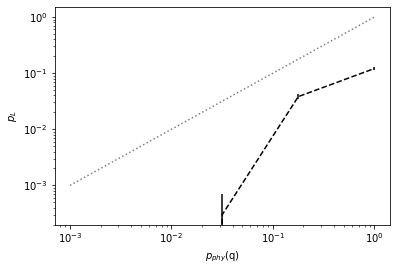
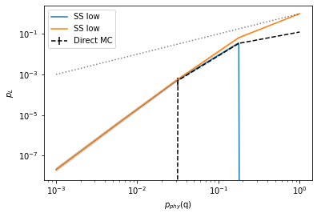
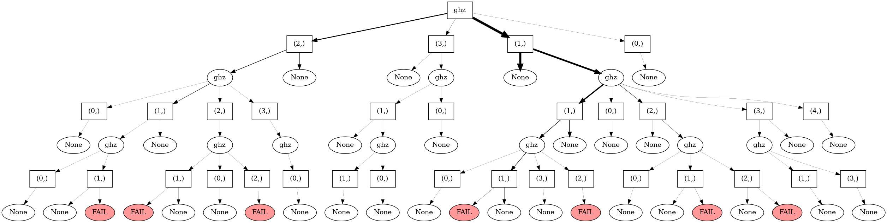

qsample
================

<!-- WARNING: THIS FILE WAS AUTOGENERATED! DO NOT EDIT! -->

# qsample

Efficient sampling of noisy quantum circuits and protocols

- Docs: https://dpwinter.github.io/qsample/

## Install

At the moment only build from source available:

    git clone https://github.com/dpwinter/qsample.git
    cd qsample
    python setup.py install

## Prerequisites

- This package requires Python 3.8 or higher.  
- pdflatex (for circuit rendering)

## When to use

qsample offers efficient and fast estimation of logical failure rates of
quantum error correction protocols when the fidelity of physical
operations in the quantum circuits is high, such as in expertimental
implementations today.

This package is for you if you want to \* model circuit-level incoherent
Pauli noise (we don’t do coherent noise here, neither are our auxiliary
qubits modelled as ideal) \* with high fidelity physical operations aka
low physical error rates \* for a QEC protocol that consists of
execution of one or more quantum circuits with in-sequence measurements
and feed-forward of measurement information \* over a specific range of
varying physical error rates

It currently offers to \* build quantum circuits from the standard
quantum gates: H, X, Z, CNOT \* run stabilizer simulations with a
standard CHP backend \* model multiparameter noise with distinct error
rates for single- and two-qubit gates: p1, p2 \* estimate logical
failure rates until uncertainty is lower than a given target confidence
interval \* choose direct Monte Carlo or Subset Sampling as sampling
method

Background information:

The predominant method to model incoherent Pauli noise in quantum
circuits is direct Monte Carlo (MC) sampling. MC is very inefficient for
low physical error rates since most of the time no actual fault event is
realized in simulation. Subset sampling circumvents this issue. With
this method, presented in , fault events are categorized into distinct
subsets which contribute to a polynomial sum expansion of the logical
failure rate. In subset sampling, only the subsets that contribute most
to the logical failure rate are actually estimated via sampling –
rendering it an importance sampling technique. Both the sampling
variance and the uncertainty from ignored, i.e. non-sampled, subsets
stay well-defined and can be held small throughout the sampling
procedure.

## Getting started

------------------------------------------------------------------------

### Library overview

1.  Circuit
2.  Protocol
3.  Error Model
4.  Simulator
5.  Sampler  
    5.1. Direct Sampler  
    5.2. Interlude: Callbacks  
    5.3. Subset Sampler

### 1. Circuit

- List of ticks
- Each tick is a dictionary, key: gate type, value: set of qubit(s)
- Recommended: 1 gate type per tick

**Example:** Flagged-GHZ preparation: \* Produce GHZ state on qubits 0-3
\* Flag-qubit 4, measure: \* 0: error-free* * 1: flip on one data
qubit\*

\* Only for max. 1 allowed fault.

``` python
from qsample import Circuit
```

``` python
ghz = Circuit([ {"init": {0,1,2,3,4}},
                {"H": {0}},
                {"CNOT": {(0,1)}},
                {"CNOT": {(1,2)}},
                {"CNOT": {(2,3)}},
                {"CNOT": {(3,4)}},
                {"CNOT": {(0,4)}},
                {"measure": {4}}], ff_det=True)
```

**ff_det**: fault-free deterministic. Set to `True` if circuit gives
unique measurement result when executed without faults.

``` python
ghz.draw()
```


### 2. Protocol

- Graph (can be cyclic)
  - Vertices: Circuits
  - Edges: transition rules = boolean\* functions (*checks*)
  - Must include **start** and **end** nodes.

\* Exception: Correction functions can return circuits for on-the-fly
execution. (special case, will not show here)

**Example:** Flagged-GHZ repeat(3)-until-success \* Execute flagged-GHZ
circuit max. 3 times. \* Only repeat if measured `1`. \* If measured
flag to be `0` within 3 iteration -\> No fail \* If after 2 iterations
3rd measurement is also `1` -\> Fail

``` python
from qsample import Protocol
```

``` python
ghz3 = Protocol(fault_tolerant=True)

ghz3.add_node('ghz', circuit=ghz) # Add node with corresponding circuit
ghz3.add_edge('START', 'ghz', check='True') # Transition START -> first circuit node always True
ghz3.add_edge('ghz', 'ghz', check='repeat(ghz)') # Transition to ghz if repeat(ghz) True.
ghz3.add_edge('ghz', 'FAIL', check='logErr(ghz)') # Transition to final node FAIL if logErr(ghz) True.
```

**fault_tolerant:** Define all weight-1 paths (circuit sequence with
max. 1 fault) to never result in a logical fail.

``` python
ghz3.draw()
```


- `repeat()` and `logErr()` are user-defined (boolean) check functions
- Measurement history of circuits stored during for protocol run
  - Can access measurement history of any circuit by passing its name as
    argument

Next, we define what the two check functions should do:

``` python
def repeat(msmt_list): # arg: list of ghz's measurment history
    return len(msmt_list) < 3 and msmt_list[-1] == 1 # If True repeat ghz

def logErr(msmt_list):
    return len(msmt_list) == 3 and msmt_list[-1] == 1 # If True transition to `FAIL`

functions = {'logErr': logErr, 'repeat': repeat}
ghz3._check_fns.update(functions) # Let protocol know about user-defined checks
```

**Note**: It is also possible that **all checks are false**. In this
case the protocol exits “insignficantly”.  
Here: “insignificant” when Flag=0 within 3 protocol runs -\> Go to next
protocol run, i.e. sample.

### 3. Error model

- Strategy:
  - Generate *fault* circuit $C_f$ of same length as reference circuit
    $C$
  - During simulation iterate $C$ and $C_f$ simulateously and apply to
    state
- Must include:
  - `group()`: group circuit locations by key, e.g. all 1-qubit-gates
  - `select()`: picks certain amount of locations from each group (not
    required by user)
  - `generate()`: generator function, returns a Pauli fault operator for
    given location

``` python
from qsample import E1

E1.groups, E1().group(ghz) # All gates in group `q`
```

    (['q'],
     {'q': [(1, 0),
       (2, (0, 1)),
       (3, (1, 2)),
       (4, (2, 3)),
       (5, (3, 4)),
       (6, (0, 4))]})

### 4. Simulator

- Two types available: Stabilizer (CHP) and Statevectors (ProjectQ
  port), both well-tested
  - https://github.com/Strilanc/python-chp-stabilizer-simulator
  - https://github.com/ProjectQ-Framework/ProjectQ
- Statevector simulator has more available gates and functions

``` python
from qsample import StabilizerSimulator as CHP
```

### 5. Sampler

- Two types: Direct (Monte Carlo) and Subset sampler
- All relevant information stored in
  [`CountTree`](https://dpwinter.github.io/qsample/sampler.tree.html#counttree)
  data structure

### 5.1. Direct sampler

``` python
from qsample import DirectSampler
import numpy as np
import matplotlib.pyplot as plt
```

Let’s define some physical error rates at which to sample:

``` python
sample_range = np.logspace(-3,0,5)
err_probs = {'q': sample_range} # Note: Must provide rate(s) for each group specified in `ErrorModel`
err_probs
```

    {'q': array([0.001     , 0.00562341, 0.03162278, 0.17782794, 1.        ])}

``` python
dsam = DirectSampler(protocol=ghz3, simulator=CHP, err_probs=err_probs, err_model=E1)
dsam.run(10000)
```

    p_phy=1.00E-03:   0%|          | 0/10000 [00:00<?, ?it/s]

    p_phy=5.62E-03:   0%|          | 0/10000 [00:00<?, ?it/s]

    p_phy=3.16E-02:   0%|          | 0/10000 [00:00<?, ?it/s]

    p_phy=1.78E-01:   0%|          | 0/10000 [00:00<?, ?it/s]

    p_phy=1.00E+00:   0%|          | 0/10000 [00:00<?, ?it/s]

``` python
p_L, std = dsam.stats()

plt.errorbar(sample_range, p_L, fmt='--', c="black", yerr=std, label="Direct MC")
plt.plot(sample_range, sample_range,'k:', alpha=0.5)
plt.xscale('log')
plt.yscale('log')
plt.xlabel('$p_{phy}$(q)')
plt.ylabel('$p_L$');
```



Check what has been sampled for the last (1e0) physical error rate:

``` python
dsam.trees[(1.0,)].draw()
```


### 5.2. Interlude: Callbacks

- Used to receive intermediate results inside sampling process
- E.g. we might want to avoid unnecessary samples (at large $p_{phy}$)
  - We can use the callback `RelStdTarget`

``` python
from qsample import callbacks as cb

dsam2 = DirectSampler(protocol=ghz3, simulator=CHP, err_probs=err_probs, err_model=E1)
dsam2.run(10000, callbacks=[cb.RelStdTarget(target=0.2)])
```

    p_phy=1.00E-03:   0%|          | 0/10000 [00:00<?, ?it/s]

    p_phy=5.62E-03:   0%|          | 0/10000 [00:00<?, ?it/s]

    p_phy=3.16E-02:   0%|          | 0/10000 [00:00<?, ?it/s]

    p_phy=1.78E-01:   0%|          | 0/10000 [00:00<?, ?it/s]

    Rel. std target of 0.2 reached. Sampling stopped.

    p_phy=1.00E+00:   0%|          | 0/10000 [00:00<?, ?it/s]

    Rel. std target of 0.2 reached. Sampling stopped.

Another callback is
[`VerboseCircuitExec`](https://dpwinter.github.io/qsample/callbacks.html#verbosecircuitexec),
which gives a detailed log of which circuits, faults and measurements
took place:

``` python
dsam3 = DirectSampler(protocol=ghz3, simulator=CHP, err_probs={'q': 0.1}, err_model=E1)
dsam3.run(10, callbacks=[cb.VerboseCircuitExec()])
```

    p_phy=1.00E-01:   0%|          | 0/10 [00:00<?, ?it/s]

    ghz -> Faults: [] -> Msmt: 0
    None
    ghz -> Faults: [] -> Msmt: 0
    None
    ghz -> Faults: [(6, {'Y': {0}})] -> Msmt: 0
    None
    ghz -> Faults: [] -> Msmt: 0
    None
    ghz -> Faults: [(4, {'Z': {2}})] -> Msmt: 0
    None
    ghz -> Faults: [(1, {'Z': {0}})] -> Msmt: 0
    None
    ghz -> Faults: [] -> Msmt: 0
    None
    ghz -> Faults: [] -> Msmt: 0
    None
    ghz -> Faults: [(4, {'X': {2}})] -> Msmt: 0
    None
    ghz -> Faults: [(2, {'Y': {0}, 'Z': {1}}), (5, {'Z': {3}})] -> Msmt: 1
    ghz -> Faults: [] -> Msmt: 0
    None

We can also write our own callback. Every sampler has 6 callback hooks:
\* Begin/End sampler \* Begin/End protocol \* Begin/End circuit

### 5.3. Subset Sampler

- Samples only at one physical error rate `pmax`
- Scaling obtained analytically
- `pmax` must be chosen in “representative” region

*Note*: 1. For multi-parameter error model `pmax` is a tuple of one
physical error rate per group. 2. The choice of `pmax` has a direct
impact of which subsets are sampled.

How to choose `pmax`? What is the heuristic? \* We want to sample, s.t.
the subset occurence probability is max. for 0-weight subset and
subsequently falling for higher order subsets. \* We want to have also
relatively high probability for other (important) subsets,
i.e. weight-1, weight-2,..

**Example:** For the Flagged-GHZ circuit we would choose a `pmax` close
to 0.1:

``` python
from qsample.sampler.base import subset_occurence, all_subsets, err_probs_tomatrix

grp = E1().group(ghz).values()
wgts_combis = all_subsets(grp)

for p_phy in [0.01, 0.1, 0.3]:
    Aws = subset_occurence(grp, wgts_combis, p_phy)
    plt.figure()
    plt.title("Subset occurence prob. $A_w$ at $p_{phy}$=%.2f" % p_phy)
    plt.bar(range(len(Aws)), Aws)
    plt.ylabel("$A_w$")
    plt.xlabel("Subsets")
```


``` python
from qsample import SubsetSampler
```

``` python
pmax = {'q': 0.1}

ss_sam = SubsetSampler(ghz3, CHP,  pmax=pmax, err_probs=err_probs, err_model=E1)
ss_sam.run(300)
```

    p_phy=1.00E-01:   0%|          | 0/300 [00:00<?, ?it/s]

*Note*: Although we passed `err_probs` those are not used for sampling.
Only when we call `stats()` those probs are used:

``` python
p_L_low, std_low, p_L_up, std_up = ss_sam.stats()

plt.errorbar(sample_range, p_L, fmt='--', c="black", yerr=std, label="Direct MC")
plt.loglog(sample_range, p_L_low, label='SS low')
plt.fill_between(sample_range, p_L_low - std_low, p_L_low + std_low, alpha=0.2)
plt.loglog(sample_range, p_L_up, label='SS low')
plt.fill_between(sample_range, p_L_up - std_up, p_L_up + std_up, alpha=0.2)
plt.plot(sample_range, sample_range,'k:', alpha=0.5)
plt.xlabel('$p_{phy}$(q)')
plt.ylabel('$p_L$')
plt.legend();
```



We sampled at a single error rate with much less samples and get a much
better bound on the logical error rate. Let’s inspect what has been
sampled:

``` python
ss_sam.tree.draw() # only one tree
```



We can store and later reload our sample results:

``` python
ss_sam.save('ghz3ss.samp')

from qsample import Sampler
stored_sam = Sampler.load('ghz3ss.samp')
counts_before = stored_sam.tree.root.counts

stored_sam.run(200) # After loading we can for example run a few more samples.
counts_after = stored_sam.tree.root.counts

print(counts_before, counts_after)
```

    p_phy=1.00E-01:   0%|          | 0/200 [00:00<?, ?it/s]

    300 500

More complex examples can be found here:
https://github.com/dpwinter/qsample/blob/master/08_examples.ipynb

## Contribute

- submit your feature request via github issue

## Team

`qsample` was developed by Don Winter based on and in collaboration with
Sascha Heußen under supervision of Prof. Dr. Markus Müller.
