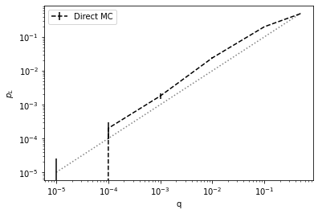
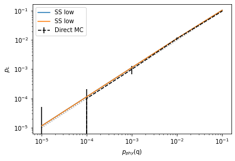
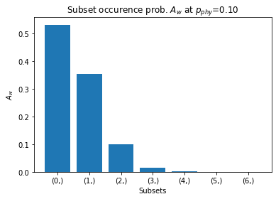
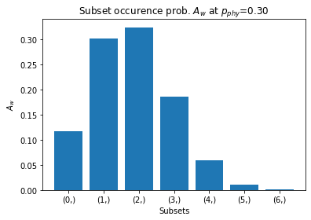

qsample
================

<!-- WARNING: THIS FILE WAS AUTOGENERATED! DO NOT EDIT! -->

## Install

    pip install qsample

## Prerequisites

- python3  
- pdflatex (for circuit rendering)

## When to use

- For QEC protocols with in-sequence measurements and feed-forward of
  measurement information
- Apply circuit-level incoherent Pauli noise at low physical error rates
  (i.e. high fidelity physical operations)
- Simulate and sample protocol execution over ranges of varying physical
  error rates, using customizable callbacks

## Getting started

``` python
import qsample as qs  # import qsample
import matplotlib.pyplot as plt  # import matplotlib for visualization of results
```

First, we need to define a quantum protocol of which we would like to
know the logical error rate. In `qsample` a protocol is represented as a
graph of quantum
[`Circuit`](https://dpwinter.github.io/qsample/circuit.html#circuit)s as
nodes and transition `checks` (to be checked at samplingt ime) as edges.

Example: To sample logical error rates of an error-corrected quantum
state teleportation protocol, we define the teleportation circuit which
sends the state of the first to the third qubit.

``` python
teleport = qs.Circuit([{"init": {0, 1, 2}},
                       {"H": {1}},
                       {"CNOT": {(1, 2)}},
                       {"CNOT": {(0, 1)}},
                       {"H": {0}},
                       {"measure": {0, 1}}])

teleport.draw()
```


Additionally, we need a circuit to (perfectly) measure the third qubit
after running `teleport`. If the outcome of this measurement is 0
(corresponding to the initially prepared $|0\rangle$ state of qubit 1)
the teleportation succeded. If the outcome is 1 however, we want to
count a logical failure of this protocol. Let’s create a circuit for
this measurement and let’s assume we can perform this measurement
without noise.

``` python
meas = qs.Circuit([{"measure": {2}}], noisy=False)
```

Between the `teleport` and `meas` circuits apply a correction to qubit 3
conditioned on the measurement outcome (syndrome) of the teleportation
circuit. We define the lookup function `lut`

``` python
def lut(syn):
    op = {0: 'I', 1: 'X', 2: 'Z', 3: 'Y'}[syn]
    return qs.Circuit([{op: {2}}], noisy=False)
```

Finally, define the circuit sequence and transition logic together
within a
[`Protocol`](https://dpwinter.github.io/qsample/protocol.html#protocol)
object. Note that protocols must always commence with a unique *START*
node and terminate at a unique *FAIL* node, where the latter expresses a
logical failure event.

``` python
tele_proto = qs.Protocol(check_functions={'lut': lut})
tele_proto.add_nodes_from(['tele', 'meas'], circuits=[teleport, meas])
tele_proto.add_edge('START', 'tele', check='True')
tele_proto.add_edge('tele', 'COR', check='lut(tele[-1])')
tele_proto.add_edge('COR', 'meas', check='True')
tele_proto.add_edge('meas', 'FAIL', check='meas[-1] == 1')

tele_proto.draw(figsize=(8,5))
```


Notice that we do not define any initial circuit for the correction
*COR* but pass our lookup function to the `check_functions` dictionary,
which makes it accessible inside the `check` transition statements
(edges) between circuits. This way we can dynamically insert circuits
into the protocol at execution time.

After the protocol has been defined we can repeatedly execute
(i.e. sample) it in the presence of incoherent noise. Let’s say we are
interested in the logical error rates for physical error rates on all 1-
and 2-qubit gates of $p_{phy}=10^{-5}, \dots, 10^{-1}$, and $0.5$. The
corresponding noise model is called
[`E1`](https://dpwinter.github.io/qsample/noise.html#e1) in qsample. The
groups of all 1- and 2-qubit gates are indexed by the key *q* in
[`E1`](https://dpwinter.github.io/qsample/noise.html#e1). Other noise
models (and their parameters) are described in the documentation.

``` python
err_model = qs.noise.E1
err_params = {'q': [1e-5, 1e-4, 1e-3, 1e-2, 1e-1, 0.5]}
```

We are ready to sample. As our protocol only contains Clifford gates
let’s choose the
[`StabilizerSimulator`](https://dpwinter.github.io/qsample/sim.stabilizer.html#stabilizersimulator),
as well as the
[`PlotStats`](https://dpwinter.github.io/qsample/callbacks.html#plotstats)
callback for plotting the resulting logical error rate as function of
$p_{phy}$.

``` python
sam = qs.DirectSampler(protocol=tele_proto, simulator=qs.StabilizerSimulator, err_model=err_model, err_params=err_params)
sam.run(n_shots=20000, callbacks=[qs.callbacks.PlotStats()])
```

    p=('1.00e-05',):   0%|          | 0/20000 [00:00<?, ?it/s]

    p=('1.00e-04',):   0%|          | 0/20000 [00:00<?, ?it/s]

    p=('1.00e-03',):   0%|          | 0/20000 [00:00<?, ?it/s]

    p=('1.00e-02',):   0%|          | 0/20000 [00:00<?, ?it/s]

    p=('1.00e-01',):   0%|          | 0/20000 [00:00<?, ?it/s]

    p=('5.00e-01',):   0%|          | 0/20000 [00:00<?, ?it/s]



Notice, that at low error rates
[`DirectSampler`](https://dpwinter.github.io/qsample/sampler.direct.html#directsampler)
performs badly, i.e. the error bars become very large, as most of the
time the protocol is executed error free and, consequently, logical
errors are measured infrequently. In this regime it is much more
efficient to use an importance sampling strategy to avoid fault-free
protocol execution and instead put more emphasis on execution with at
least one fault happening. This approach is implemented in the
[`SubsetSampler`](https://dpwinter.github.io/qsample/sampler.subset.html#subsetsampler)
class. We only need to specify **two additional parameter** `p_max`
which specifies the $p_{phy}$ at which sampling takes place, and `L`,
the length of the longest possible fault-free path. The parameter
`p_max` must be chosen experimentally by repeated sampling and observing
which subsets have the largest impact on the failure rate. We must
always choose a value such that the subset occurence probability has an
exponentially falling shape. Only in this case are the scaling of the
sampler results valid. Below we see that for the teleportation circuit
`p_max`-values of 0.01 and 0.1 are still okay, while 0.3 would be
problematic. For more information refer to the linked publication.

``` python
for p_phy in [0.01, 0.1, 0.3]:
    Aws = qs.math.subset_probs(teleport, err_model(), p_phy)
    plt.figure()
    plt.title("Subset occurence prob. $A_w$ at $p_{phy}$=%.2f" % p_phy)
    plt.bar(list(map(str,Aws.keys())), Aws.values())
    plt.ylabel("$A_w$")
    plt.xlabel("Subsets")
```







Let’s choose a $p_{max}=0.1$ for the same error model as before and
start sampling. (Note the significant difference in the number of
samples).

``` python
ss_sam = qs.SubsetSampler(protocol=tele_proto, simulator=qs.StabilizerSimulator,  p_max={'q': 0.1}, err_model=err_model, err_params=err_params, L=3)
ss_sam.run(1000, callbacks=[qs.callbacks.PlotStats()])
```

    p=('1.00e-01',):   0%|          | 0/1000 [00:00<?, ?it/s]


The sampling results are internally stored by the
[`SubsetSampler`](https://dpwinter.github.io/qsample/sampler.subset.html#subsetsampler)
in a [`Tree`](https://dpwinter.github.io/qsample/sampler.tree.html#tree)
data structure. In the tree we can also see why we chose `L`=3, as there
are three circuits in the fault-free path sequence.

``` python
ss_sam.tree.draw(verbose=True)
```


We see that only the teleportation protocol has fault weight subsets,
while the *meas* and *COR* circuits are noise-free (i.e. they only have
the 0-subset). The leaf nodes *FAIL* and *None* represent logical
failure and successful teleportation events, respectively. $\delta$
represents the missing subsets which have not been sampled and which
result in the upper bound on the failure rate.

Finally, let’s compare the results of
[`DirectSampler`](https://dpwinter.github.io/qsample/sampler.direct.html#directsampler)
and
[`SubsetSampler`](https://dpwinter.github.io/qsample/sampler.subset.html#subsetsampler).

``` python
p_L_low, std_low, p_L_up, std_up = ss_sam.stats()
p_L, std = sam.stats()

sample_range = err_params['q']
plt.errorbar(sample_range, p_L, fmt='--', c="black", yerr=std, label="Direct MC")
plt.loglog(sample_range, p_L_low, label='SS low')
plt.fill_between(sample_range, p_L_low - std_low, p_L_low + std_low, alpha=0.2)
plt.loglog(sample_range, p_L_up, label='SS low')
plt.fill_between(sample_range, p_L_up - std_up, p_L_up + std_up, alpha=0.2)
plt.plot(sample_range, sample_range,'k:', alpha=0.5)
plt.xlabel('$p_{phy}$(q)')
plt.ylabel('$p_L$')
plt.legend();
```


## More things to explore

- `qsample.examples` shows more examples of protocol and protocol
  samplings.
- `qsample.noise` defines more complex error models, as well as a
  superclass
  [`ErrorModel`](https://dpwinter.github.io/qsample/noise.html#errormodel)
  which can be used to define custom error models.
- `qsample.callbacks` defines more callbacks, as well as the superclass
  [`Callback`](https://dpwinter.github.io/qsample/callbacks.html#callback)
  which allows for the implementation of custom callbacks.

## Contribute

- Feel free to submit your feature request via github issues

## Team

`qsample` was developed by Don Winter in collaboration with Sascha
Heußen under supervision of Prof. Dr. Markus Müller.
